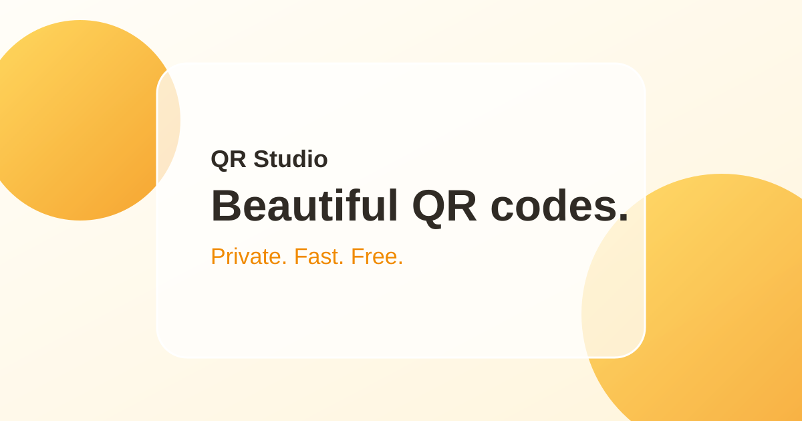

# QR Studio — Free QR Code Generator



QR Studio is a lightweight, privacy-first QR Code Generator built with HTML, CSS, and vanilla JavaScript. It runs entirely in the browser and is designed to deploy directly to GitHub Pages.

## Features

- URL, plain text, email, phone, SMS, and Wi-Fi QR payloads
- Live QR preview while you type
- Foreground and background color controls
- 256 × 256, 512 × 512, and 1024 × 1024 output sizes
- Low, Medium, Quartile, and High QR error correction
- Adjustable quiet-zone margin, with a safe minimum of 4 modules
- PNG and SVG downloads generated client-side
- Copy payload to clipboard
- Copy QR image when the browser supports image clipboard access
- Web Share support when available
- Responsive, accessible glassmorphism-inspired interface
- No account, backend, database, API key, or server-side processing

## Technologies

- HTML5
- CSS3
- Vanilla JavaScript
- [qrcode-generator](https://www.npmjs.com/package/qrcode-generator) v1.4.4, loaded from jsDelivr

## Local usage

1. Download or clone this repository.
2. Open `index.html` in a modern browser.
3. An internet connection is required to load the QR generation library from the CDN.

For local development with a simple static server, you can also use any static-file server of your choice.

## Deploy to GitHub Pages

1. Push the repository to GitHub.
2. Open the repository **Settings**.
3. Open **Pages**.
4. Choose **Deploy from a branch**.
5. Select the `main` branch and the root (`/`) folder.
6. Save.
7. Open the generated GitHub Pages URL.

## Project structure

```text
/
├── index.html
├── css/
│   └── style.css
├── js/
│   └── app.js
├── assets/
│   ├── icons/
│   └── images/
│       └── og-preview.svg
├── favicon.svg
├── README.md
├── LICENSE
└── .gitignore
```

## Privacy

QR content is processed in your browser. The application does not send the text, URLs, contact details, Wi-Fi credentials, or generated QR image to a backend. The only external request is for the open-source QR generation library loaded from jsDelivr.

## Browser support

QR Studio targets current versions of Chrome, Edge, Firefox, and Safari. Core QR generation and downloads work broadly. Clipboard image copying and Web Share are progressively enhanced and appear only when the browser exposes the corresponding APIs.

## License

This project is released under the MIT License. See [LICENSE](LICENSE).
